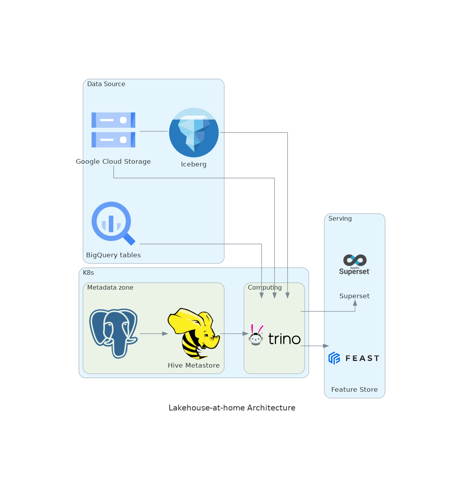

# Mini Data Lakehouse

Build your data lakehouse at home, with open source components to power machine learning feature store and data visualization.

## General Architecture

## Guides

### For docker-based setup

Go to [docker/README.md](docker/README.md)

### For k8s-based setup
(TBD)

## Roadmap

- [x] Deploy Hive metastore
- [x] Deploy Trino cluster with 2 workers
- [x] Connect Trino to BQ (wont do)
- [x] Replace GCS with MinIO
- [x] Connect Trino to Feast ([demo](./feature_store/demo.ipynb))
- [ ] Deploy Superset dashboard to serve data
